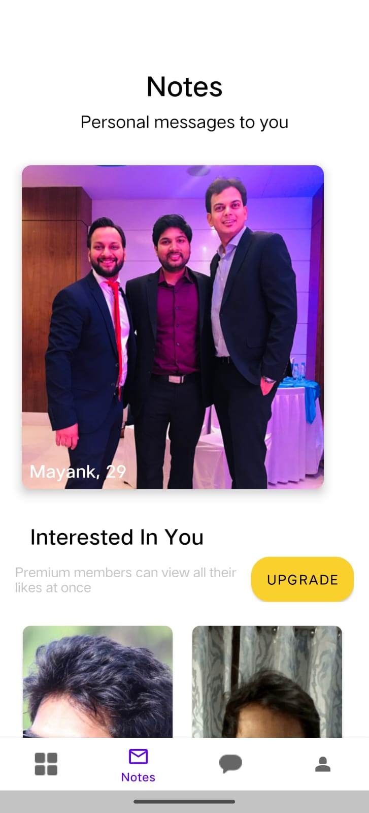

# Aisle Assignment

## Problem 1
Aisle has millions of users from over 150 countries. Each user gets 10 free daily likes. Unused likes are not carried forward to the next day. The task is to refresh the number of daily likes at 12:00 pm according to the user's local time.

## Introduction
This solution aims to achieve a scalable approach in the Aisle Android application to refresh users' daily Likes at 12:00 pm based on their local time.

### 1. User Identification and Like Tracking
- Assign a unique identifier to each user.
- Maintain a server or database to store users' like counts and timestamps of their actions.

### 2. Timezone Handling
- Store the user's preferred time zone during account setup or login.
- Use the device's timezone settings or a location-based service to determine the user's timezone.

### 3. Daily Refresh Logic
- Implement a server-side scheduled task that runs daily at a specific time (e.g., 12:00 pm UTC).
- For each user:
  - Retrieve the user's timezone from their profile.
  - Convert the server's 12:00 pm UTC to the user's local time using their timezone.
  - Compare the user's local time with the converted 12:00 pm time. If they match or if the user's time is after 12:00 pm, proceed to the next step.
  - Reset the user's like count to 10 for the new day.
  - Update the timestamp of the last like refresh.

### 4. Error Handling and Edge Cases
- Account for cases where users change time zones or daylight saving time changes.
- Handle users in different parts of the world with varying local 12:00 pm times.

### 5. Background Job Scheduler
- Create a background job scheduler on the server.
- Periodically check user data and, if required, reset daily likes for users whose local time has reached or passed 12:00 pm.

### 6. Scalability Considerations
- Set up the server application in a scalable architecture using cloud services (AWS, Google Cloud, Azure).
- Implement load balancing to distribute API requests evenly.
- Optimize database design and queries for efficient data handling.
- Implement caching mechanisms to improve response times and reduce database load.


## Problem 2 

This Android project demonstrates the implementation of three screens based on the provided Figma design. 
It utilizes Kotlin, MVVM architecture, Retrofit for API calls, and follows the described flow using the Phone number API, OTP API, and Notes API.


### Features
- **User Authentication Flow:** The app guides the user through a seamless authentication process involving phone number verification and OTP entry.

- **API Integration:** The project showcases how to interact with backend APIs using Retrofit for smooth data exchange between the app and the server.

- **MVVM Architecture:** The project follows the Model-View-ViewModel (MVVM) architectural pattern, promoting clean separation of concerns and maintainability.

- **Customizable UI Design:** The UI design can be easily customized based on the provided Figma design, providing a visually appealing and consistent user experience.

- **Error Handling:** The app demonstrates error handling by managing API call failures, providing feedback to the user, and allowing for smooth recovery.

- **Notes Display:** Upon successful authentication, the user can view their notes retrieved from the server using the Notes API.


### Screens
- Screen 1: Phone Number Entry 
    - In this screen, the user can enter their phone number and country code. 
    - After clicking the Continue button, the Phone number API is called. 
    - If the API call is successful, the user will be navigated to Screen 2. 
    - 
- Screen 2: OTP Verification
    - On this screen, the user enters the OTP . 
    - After clicking the Continue button, the OTP API is called. 
    - If the API call is successful and returns an auth token, the user will be directed to Screen 3.
  
- Screen 3: Notes Display
    - In this screen, the user's notes are displayed. 
    - The Notes API is called using the previously obtained auth token in the header.


### API Integration
- Base URL: https://app.aisle.co/V1

- **Phone Number API**
   - Method: POST
   - End Point: /users/phone_number_login
   - Parameter: {'number': "+919876543212"}
   - Response:
      ```
      {
        "status": true,
      }
      ```

- **OTP API**
   - Method: POST
   - End Point: /users/verify_otp
   - Parameter: {'number': "+919876543212", 'otp': "1234"}
   - Response:
    ```
    {
      "token": 234567yghfdskeryr920weruf
    }
    ```

- **Notes API**
   - Method: GET
   - End Point: /users/test_profile_list
   - Header: {'Authorization': 'auth_token'}
   - Response:
    ```
    {
       {
    invites={
        profiles=[
            {
                general_information={
                    date_of_birth=1993-02-11,
                    date_of_birth_v1=11th February 1993,
                    location={
                        summary=IN, Rampur, full=Rampur, Uttar Pradesh, IN
                    },
                    drinking_v1={
                        id=6.0,
                        name=Drinks Occasionally,
                        name_alias=Drinks Occasionally
                    },
                    first_name=Mayank,
                    gender=Male,
                    marital_status_v1={
                        id=9.0,
                        name=Single,
                        preference_only=false
                    },
                    ref_id=1C76E221,
                    smoking_v1={
                        id=2.0,
                        name=Non-Smoker,
                        name_alias=Non-Smoker
                    },
                    sun_sign_v1={
                        id=2.0,
                        name=Aquarius
                    },
                    mother_tongue={
                        id=2.0,
                        name=Hindi
                    },
                    faith={
                        id=6.0,
                        name=Hindu
                    },
                    height=62.0,
                    cast=null,
                    kid=null,
                    diet=null,
                    politics=null,
                    pet=null,
                    settle=null,
                    mbti=null,
                    age=29.0
                },
                approved_time=1.620885330138944E9,
                disapproved_time=1.6179514025616488E9,
                photos=[
                    {
                        photo=https://testimages.aisle.co/f39552690128813a6e893b4f4cd725fc729869938.png,
                        photo_id=130633.0,
                        selected=true,
                        status=avatar
                    },
                    {
                        photo=https://testimages.aisle.co/2cb58925723382f002ba3f4d8f573011729866682.png,
                        photo_id=130632.0,
                        selected=false,
                        status=null
                    }
                ],
                user_interests=[],
                work={
                    industry_v1={
                        id=13.0,
                        name=Information Technology,
                        preference_only=false
                    },
                    monthly_income_v1=null,
                    experience_v1={
                        id=5.0,
                        name=6 Years Experience,
                        name_alias=6 Years Experience
                    },
                    highest_qualification_v1={
                        id=1.0,
                        name=Bachelors,
                        preference_only=false
                    },
                    field_of_study_v1={
                        id=2.0,
                        name=Engineering
                    }
                },
                preferences=[
                    {
                        answer_id=32669.0,
                        id=10.0,
                        value=0.0,
                        preference_question={
                            first_choice=Indoor,
                            second_choice=Outdoor
                        }
                    },
                    {
                        answer_id=32671.0,
                        id=15.0,
                        value=0.0,
                        preference_question={
                            first_choice=Indie,
                            second_choice=Mainstream
                        }
                    },
                    {
                        answer_id=32670.0,
                        id=21.0,
                        value=0.0,
                        preference_question={
                            first_choice=Logical,
                            second_choice=Emotional
                        }
                    },
                    {
                        answer_id=32668.0,
                        id=2.0,
                        value=1.0,
                        preference_question={
                            first_choice=Adopt,
                            second_choice=Conceive
                        }
                    },
                    {
                        answer_id=32667.0,
                        id=20.0,
                        value=1.0,
                        preference_question={
                            first_choice=Creationist,
                            second_choice=Evolutionist
                        }
                    }
                ],
                instagram_images=null,
                last_seen_window=2021-05-21T06:21:15.056Z,
                is_facebook_data_fetched=false,
                icebreakers=null,
                story=null,
                meetup=null,
                verification_status=verified,
                has_active_subscription=false,
                show_concierge_badge=false,
                lat=28.79,
                lng=79.02,
                last_seen=null,
                online_code=0.0,
                profile_data_list=[
                    {
                        question=Philosophy,
                        preferences=[
                            {
                                answer_id=32669.0,
                                answer=Indoor than Outdoor,
                                first_choice=Indoor,
                                second_choice=Outdoor
                            },
                            {
                                answer_id=32671.0,
                                answer=Indie than Mainstream,
                                first_choice=Indie,
                                second_choice=Mainstream
                            },
                            {
                                answer_id=32670.0,
                                answer=Logical than Emotional,
                                first_choice=Logical,
                                second_choice=Emotional
                            },
                            {
                                answer_id=32668.0,
                                answer=Conceive than Adopt,
                                first_choice=Conceive,
                                second_choice=Adopt
                            },
                            {
                                answer_id=32667.0,
                                answer=Evolutionist than Creationist,
                                first_choice=Evolutionist,
                                second_choice=Creationist
                            }
                        ],
                        invitation_type=preference
                    }
                ]
            }
        ],
        totalPages=1.0,
        pending_invitations_count=1.0
    },
    likes={
        profiles=[
            {
                first_name=Ajith,
                avatar=https://testimages.aisle.co/dd510d5260eeebcdc7d7fc752c598c39728894004.png
            },
            {
                first_name=Ishant,
                avatar=https://testimages.aisle.co/58b125e52d319c0390fc2d68b7da2ba6729804903.png
            }
        ],
        can_see_profile=false,
        likes_received_count=2.0
    }
    }
    ```


### Architecture
The application follows the MVVM (Model-View-ViewModel) architectural pattern.

The major components of the architecture are:
- Model: Represents the data and business logic of the application. It includes data models, repositories for data access, and network for api service.
- View: Represents the UI layer of the application. It includes activities, fragments, XML layout files, adapters and corresponding view models.
- ViewModel: Acts as a mediator between the View and the Model. It contains the presentation logic, handles UI-related events, and exposes observable data to the View using LiveData.


### Prerequisites
Before running the application, ensure you have the following:
- Android Studio
- Android SDK
- Kotlin
- JDK
- Gradle


### Project Setup
1. Clone this repository to your local machine using the following command:
```
https://github.com/IshikaNimade/AisleTechChallenge.git
```
2. Open Android Studio and navigate to the project directory.
3. Build and run the app on an Android emulator or a physical device.


## Configuration
To configure the application, follow these steps:

1. Open the `app` module.
2. Update the `app/src/main/res/values/strings.xml` file with your desired configurations, such as API endpoints, keys, or other settings.
3. Build and run the application.


### Usage
1. Launch the app on your Android emulator or device.

2. **Screen 1: Phone Number Entry**
  - Enter the phone number (e.g., 9876543212) in the designated field.
  - Enter the country code (e.g., +91).
  - Click the "Continue" button.

3. **Screen 2: OTP Verification**
  - Enter the OTP (e.g., 1234) in the OTP field.
  - Click the "Continue" button.
  - On successful verification , you will be navigated to the screen 3.

4. **Screen 3: Notes Display**
  - After successful authentication, your notes will be displayed on this screen.


### Screenshots

#### Phone Number Screen
  

#### OTP Screen
  

#### Notes Scree
  


## Contributing
For any inquiries or support, please contact [ishikanimade56@gmail.com](mailto:ishikanimade56@gmail.com).

Feel free to customize the sections and content as per your specific application requirements and reach out to us with any questions, feedback, or suggestions you may have.
